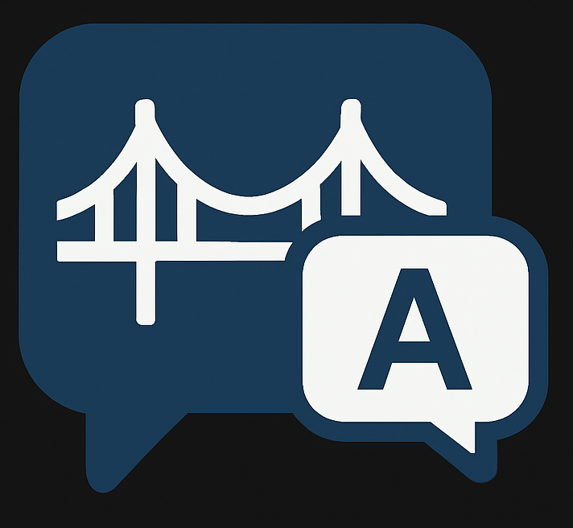

#   BridgeTalk

  
  


> **BridgeTalk** is a modern chatting application built with the **MERN stack + TailwindCSS**, powered by **Firebase** for authentication and database.  
> What makes BridgeTalk unique is its **built-in multilingual translation system**, enabling users from different regions to chat seamlessly in their preferred languages.  

---

# Live Link
> <a href="https://bridge-talk-privated.vercel.app" target="_blank">Open BridgeTalk</a>
---

## 🚀 Features  

✅ Real-time messaging (like WhatsApp/Messenger)  
✅ Multi-language translation (auto-translates messages to user’s preferred language)  
✅ Secure authentication with Firebase  
✅ Media support (images, documents, videos)  
✅ User-friendly and responsive design with TailwindCSS  
✅ Copy-protected with license terms  
✅ Deployed on **Vercel** for fast performance  

---

## 🌍 Use Case Example  

- A user in **Germany** sets their language preference to **German**  
- A user in **India** sets their language preference to **English**  
- When they chat, **German user sees all messages in German**, while **Indian user sees all messages in English**  
- BridgeTalk breaks the communication barrier

---

## 🛠️ Tech Stack  

| Frontend | Backend | Database & Auth | Deployment | Styling |
|----------|---------|-----------------|------------|----------|
|  |  |  |  |  |
|  |  | Authentication, Firestore | Fast & Reliable Hosting | Modern, responsive UI |

---

## 📦 Installation & Setup  

1. **Clone the repository**  
   ```bash
   git clone https://github.com/vishalvishwas01/BridgeTalk.git
2. **Navigate into the project folder**
    ```bash
    cd BridgeTalk
3. **Install dependencies**
   ```bash
   npm install
4. **Set up Firebase**
   -  Create a Firebase project
   -  Enable Authentication & Firestore
   -  Add your Firebase config in: ***/src/lib/firebase.js***
4. **Run the development server**
   ```bash
   npm run dev
5. **Open the app in your browser**
   ```bash
   http://localhost:3000

## 📜 License  

This project is licensed under the **GNU Affero General Public License v3.0 (AGPL-3.0)**.  
You are free to use, modify, and distribute this project under the terms of the license.  

For more details, see the [LICENSE](./LICENSE) file.


